# PostMatic

PostMatic est une application de blog moderne construite avec la stack MERN (MongoDB, Express, React, Node.js). Elle permet aux utilisateurs de créer, lire, mettre à jour et supprimer des articles, tout en offrant une expérience utilisateur fluide et agréable.

## Fonctionnalités

### Backend

- **Authentification sécurisée** : Utilisation de JSON Web Tokens (JWT) pour sécuriser les endpoints d'API.
- **Gestion des utilisateurs** : Création de faux utilisateurs grâce à une API externe, facilitant le développement et les tests.
- **Validation des données** : Protection des requêtes avec `express-validator`.
- **Cryptage des mots de passe** : Utilisation de `bcrypt` pour sécuriser les mots de passe des utilisateurs.

### Frontend

- **Gestion des formulaires** : Utilisation de `React Hook Form` et `Yup` pour une validation et une gestion efficaces des formulaires.
- **Éditeur de texte** : Intégration de `React-Quill` pour une interface d'édition riche et intuitive.
- **Styles modernes** : Utilisation de `Tailwind CSS` et `Flowbite-React` pour un design réactif et élégant.
- **Traduction** : Intégration de `i18next` pour gérer plusieurs langues.
- **Téléversement de fichiers** : Utilisation de `Firebase` pour l'upload d'images et l'authentification via Google.
- **Navigation fluide** : Utilisation de `React Router` pour gérer la navigation, avec des loaders pour le chargement des données.
- **Linting** : Utilisation de `ESLint` pour garantir un code propre et conforme aux meilleures pratiques.

## Installation

1. **Clonez le répertoire** :

```bash
   git clone https://github.com/your-repository/mern-blog.git
```

2. **Installez les dépendances** :

```bash
   cd api
   npm install
```

```bash
   cd client
   npm install
```

3. **Configurer votre base de donnée MongoDB** :
   Assurez vous d'avoir une instance de MongoDB en cours d'éxecution et mettez à jour les paramètres de connexion dans le fichier `.env` du backend

```bash
PORT=3000
MONGODB_URI=
MONGODB_URI_TEST=
JWT_SECRET=
```

5. **Configurer Firebase**:

- **Créez un projet Firebase:**

  - Rendez vous sur `Firebase Console`
  - Créez un nouveau projet en suivant les instructions à l'écran

- **Activer l'authentification Google:**

  - Dans votre projet Firebase, accédez à la section Authentication
  - Cliquez sur l'onglet `Sign-in-method`
  - Activer l'authentification Google et configurer les options selons vos besoins

- **Ajouter votre clé API Firebase dans le fichier `.env` du frontend:**

```bash
VITE_FIREBASE_API_KEY=
```

6. **Lancez le serveur backend** :

```bash
    cd api
    npm run dev
```

7. **Lancez le serveur frontend** :

```bash
    cd client
    npm run dev
```

## Technologies Utilisées

- **Backend**: Node.js, Express, MongoDB, JWT, Bcrypt, Express-Validator
- **Frontend**: React, Redux, React Hook Form, Yup, Tailwind CSS, Flowbite, React-Quill, Firebase, i18next

## Screenshots

Here are some screenshots of the application:

<div align="center" style="margin-bottom: 20px;">
  <h2 style="text-decoration: underline;">Home Page</h2>
  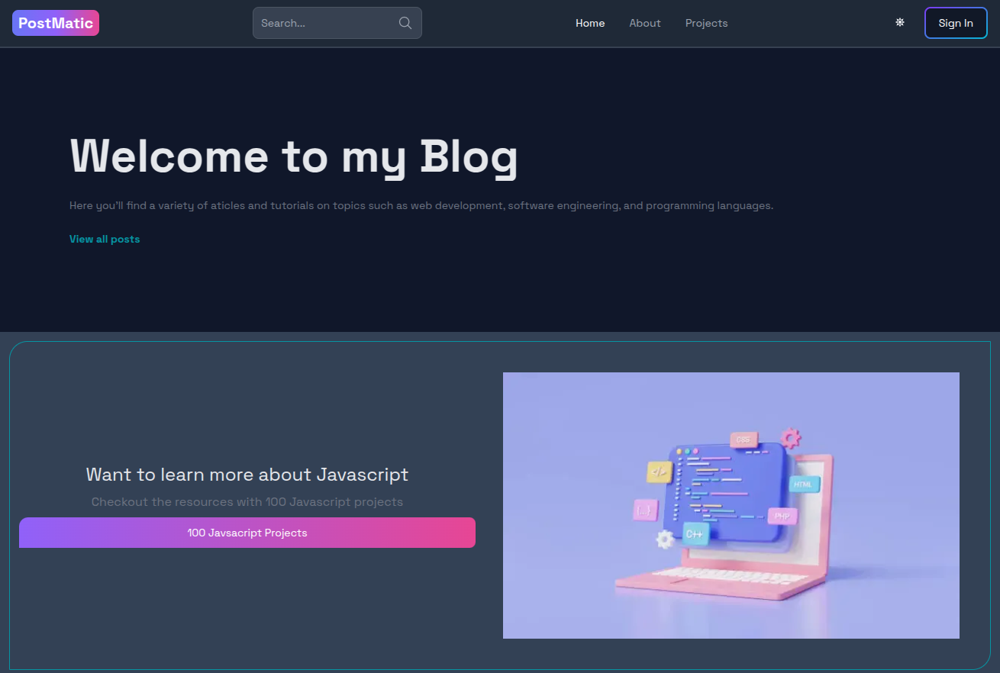
  <hr style="border: 2px solid white; width: 80%;">
  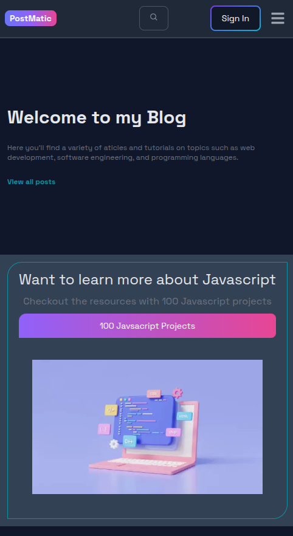
</div>

<div align="center" style="margin-bottom: 20px;">
  <h2 style="text-decoration: underline;">Posts Page</h2>
  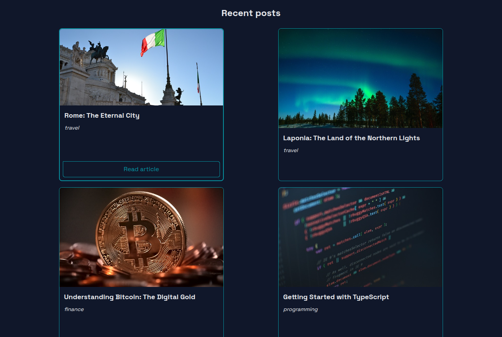
  <hr style="border: 2px solid white; width: 80%;">
  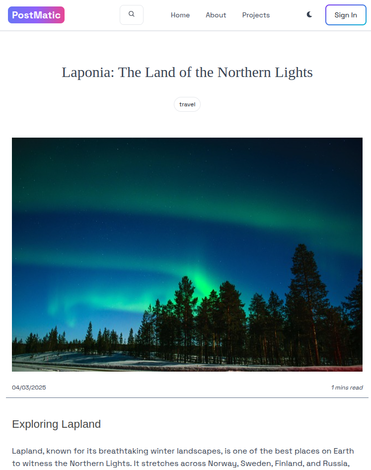
  <hr style="border: 2px solid white; width: 80%;">
  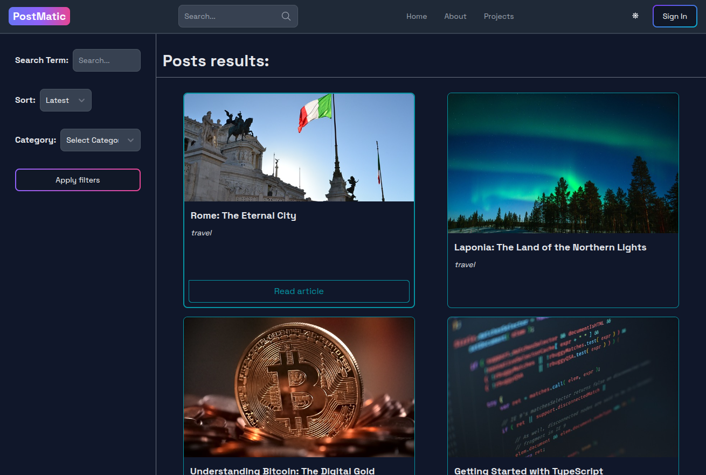
  <hr style="border: 2px solid white; width: 80%;">
  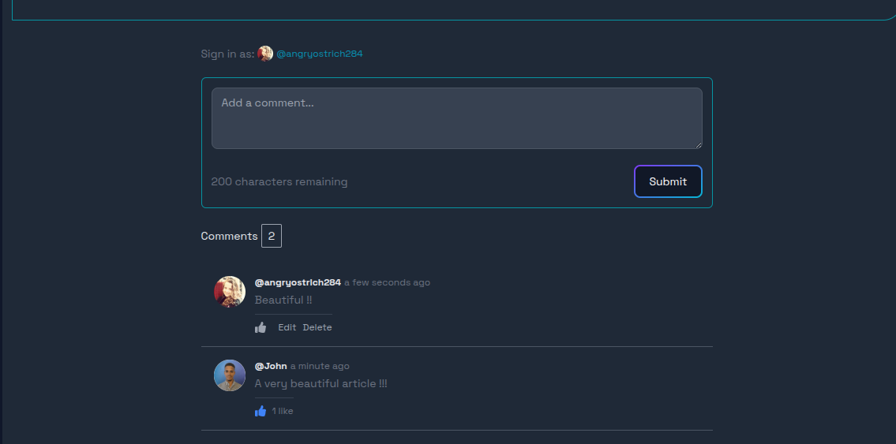
</div>

**Auth pages** :

<div align="center" style="margin-bottom: 20px;">
  <h2 style="text-decoration: underline;">Register and Signin</h2>
  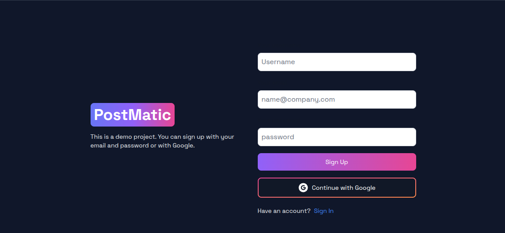
  <hr style="border: 2px solid white; width: 80%;">
  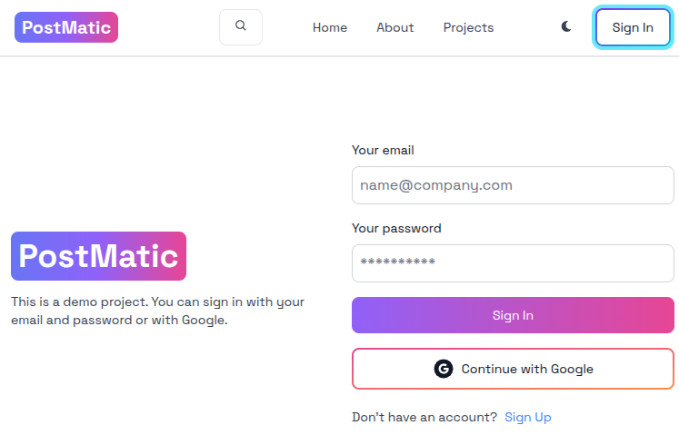
</div>

**Protected Pages** :

**Not admin**

<div align="center" style="margin-bottom: 20px;">
  <h2 style="text-decoration: underline;">Not Admin Dashboard</h2>
  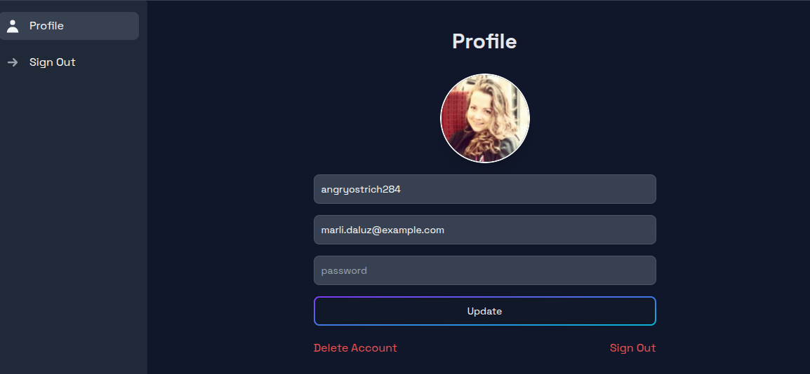
</div>

**Admin**

<div align="center" style="margin-bottom: 20px;">
  <h2 style="text-decoration: underline;">Admin Dashboard</h2>
  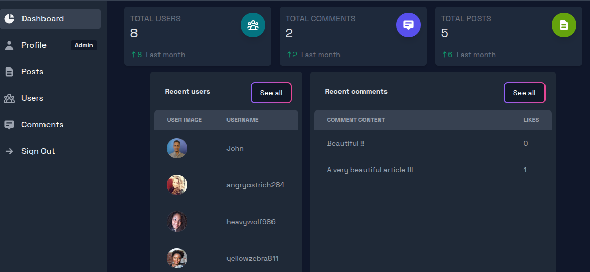
  <hr style="border: 2px solid white; width: 80%;">
  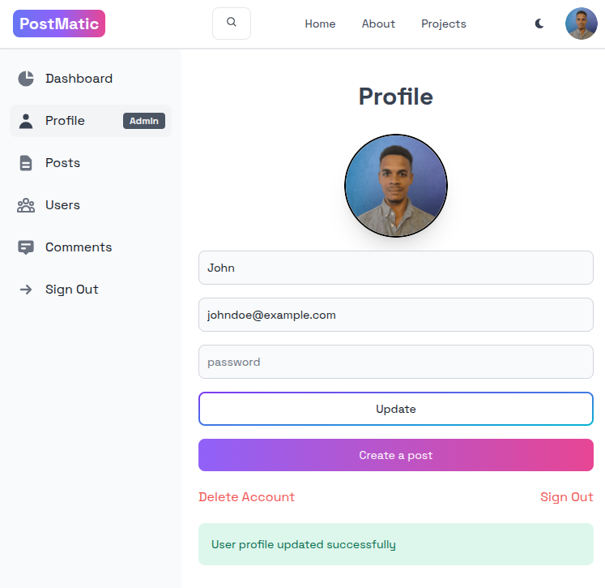
  <hr style="border: 2px solid white; width: 80%;">
  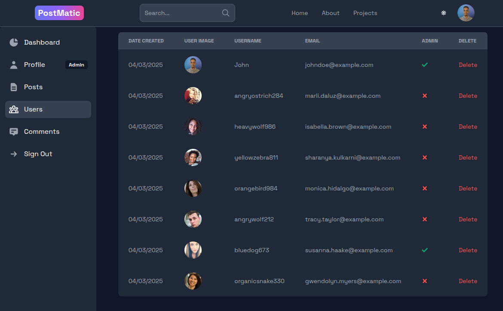
  <hr style="border: 2px solid white; width: 80%;">
  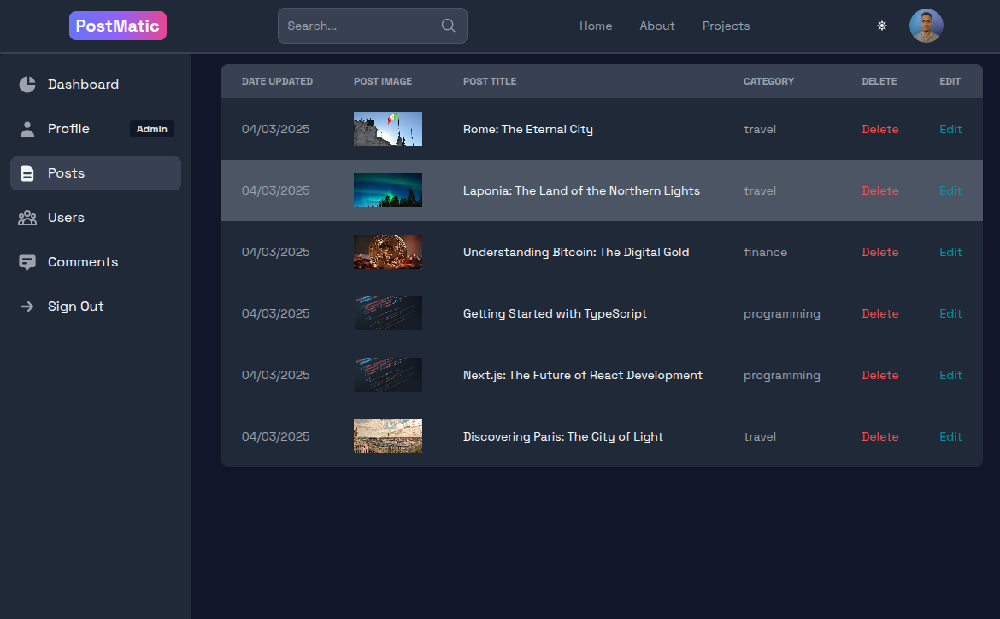
  <hr style="border: 2px solid white; width: 80%;">
  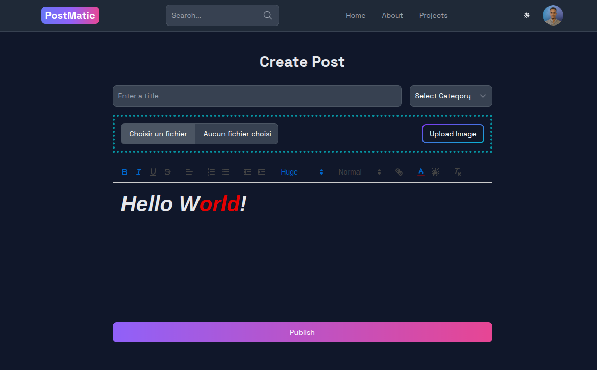
</div>
